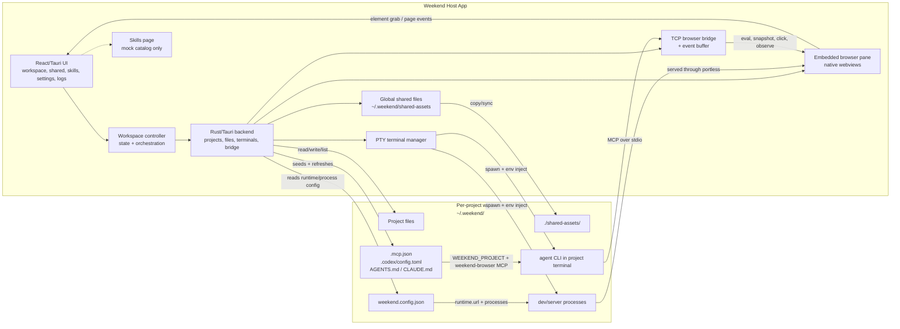

# Weekend Platform Review

## Verdict

Weekend is already a strong integrated host product for local AI-assisted web development.
It is not yet a strong general platform.

The codebase is best understood as:

- a host app that owns project lifecycle, runtime launch, browser inspection, and terminal orchestration
- a project scaffold that makes agent CLIs project-aware
- a shared-file distribution mechanism
- a placeholder skills surface, not a real extension system

## Current-State Diagram

## Interaction Model

1. Project creation

- The host app creates a project under `~/.weekend/<project>`.
- It writes `weekend.config.json`, syncs current shared files into `./shared-assets/`, and seeds `.mcp.json`, `.codex/config.toml`, `AGENTS.md`, and `CLAUDE.md`.

2. Workspace orchestration

- The React workspace route composes browser, editor, settings, and terminal panes around a single focused project.
- The workspace controller is the frontend orchestrator; the Tauri backend is the system of record for projects, files, terminals, and browser bridge state.

3. Runtime launch

- Pressing Play reads the project config, creates terminal sessions for configured processes, and wraps `dev-server` processes with `portless` when needed.
- The browser pane loads the configured runtime URL into a native embedded webview, not a separate headless browser.

4. Agent/browser loop

- Project terminals get `WEEKEND_PROJECT`, bridge token/path, and runtime env injected by the host app.
- The seeded `.mcp.json` and `.codex/config.toml` point supported agent CLIs at the bundled `weekend-browser-mcp` sidecar.
- The sidecar resolves the correct project/browser context and talks back to the host app over a local TCP bridge.

5. Shared files

- Shared files live centrally under `~/.weekend/shared-assets`.
- The host app copies them into each project at `./shared-assets/` on project creation, startup backfill, and shared-file mutations.

6. Skills

- The `/skills` page is not connected to any backend, filesystem, install command, or persistence layer.
- Today the real agent integration surface is the seeded config and guidance files, not the skills UI.

## Review Findings

1. Project-level agent instructions are host-owned, not project-owned.

- `seed_agent_runtime_guidance_files` unconditionally rewrites `CLAUDE.md` and `AGENTS.md`, and startup refresh applies that to every existing project.
- This means repo-specific or user-authored guidance gets replaced by host-authored guidance.
- For a host app that wants to be a platform, this is a major autonomy problem: the host app is not just integrating with projects, it is asserting control over their agent contract.

2. Shared files are mirrored copies, not true shared resources.

- `sync_shared_assets_into_project` copies every file into `./shared-assets/` and deletes stale files there.
- At the same time, normal project file write/rename/delete commands can freely mutate `./shared-assets/` from inside the editor.
- The result is ambiguous ownership: project-local edits look real, but the next global shared-file sync can overwrite or delete them.
- This is product-useful, but platform-weak. It behaves like distribution, not composition.

3. Project rename does not fully re-key terminal backend state.

- `rename_project` re-keys `terminal_state.sessions`, but it does not update `terminal_state.session_info` or `opening_sessions`.
- Metadata APIs and terminal watchers read `session_info`, so rename can leave stale terminal IDs in backend metadata even after the filesystem rename succeeds.
- This is a concrete platform integrity bug because project identity is one of the main context boundaries in the app.

4. The skills surface is presentational only.

- The skills catalog is hard-coded in React.
- Installing a skill only updates local component state; there is no persistence, no project/global target directory, and no backend action.
- The product currently signals “platform marketplace” UX without the underlying install/runtime model.

5. Stop semantics now follow runtime ownership.

- `stopProject` removes play-spawned runtime processes while keeping user-created and agent sessions alive.
- Full project teardown still happens through delete/archive, where killing project sessions is expected.

## Strengths

- Strong project context propagation.
- The bridge story is coherent: terminals receive project/runtime env, seeded config points agents at the bundled MCP server, and the MCP sidecar can recover project context from env or cwd.
- The browser automation is tied to the live visible browser pane, which is a strong product differentiator and a solid platform primitive.
- The host app owns the full local-dev loop.
- Project config, PTY terminals, browser pane, runtime probing, and shared-file distribution are all orchestrated from one place.
- This makes the product feel reliable and legible for the narrow use case it targets.
- The project contract is explicit.
- `weekend.config.json` defines runtime/process behavior, and the app keeps all projects under one predictable root.
- That gives the host app a clean control plane for launch, browsing, and archiving.

## Weaknesses

- Extensibility is mostly hard-coded.
- Runtime mode is effectively fixed to `portless`, and process roles are a small fixed enum.
- The app is currently opinionated software with integration points, not a host platform with stable extension boundaries.
- Project autonomy is low.
- The host app writes project docs and agent config, owns shared-file fan-out, and couples browser context to host-managed files and env.
- That is efficient for bootstrapping, but weak if you want projects to remain independently portable.
- Shared files have confusing semantics.
- They are presented as project files, but they are actually cache-like replicas of a global source of truth.
- Skills are not a real subsystem yet.
- The UI exists, but the install, persistence, discovery, execution, and scoping model does not.

## Platform Assessment

Weekend is strongest as a vertical product:

- local AI web-dev workspace
- managed runtime launcher
- visible browser + MCP bridge
- project-scoped terminals

Weekend is weaker as a platform because its core contracts are still host-defined and host-enforced:

- the host app rewrites agent guidance
- shared files are replicated by the host app
- runtime modes and process roles are closed over host assumptions
- skills are not yet backed by real platform primitives

The practical reading is:

- If the goal is a polished single-app environment for local AI web work, the foundation is good.
- If the goal is a platform where projects, skills, and host app features can evolve independently, the current boundaries are too tight.

## Recommended Next Steps

1. Stop overwriting `CLAUDE.md` and `AGENTS.md`.

- Seed once on project creation, or write host guidance to a dedicated host-owned file that agent tooling can include.

2. Turn shared files into an explicit platform concept.

- Either mount/link them read-only into projects, or block project-local mutation inside `./shared-assets/` and route edits back through the shared-file subsystem.

3. Fix project rename to re-key all backend session metadata.

- `sessions`, `session_info`, and `opening_sessions` need to stay consistent.

4. Define a real skills contract.

- Decide where project and global skills live, how install/uninstall works, how skills are discovered, and how the host app surfaces active skills to agent runtimes.

5. Keep runtime stop separate from workspace teardown.

- Preserve the separation as new process roles and teardown actions are added.

## Verification

- `pnpm test` passes.
- `cargo test` passes.
- The issues above are architectural and behavioral gaps that are not covered by the current automated tests.
