# Rust Shell Surfaces

This is the map of how the Rust/Tauri app sees the React shell, project
directories, running project processes, native browser webviews, and the MCP
sidecar.

## Mental Model

The desktop app has two Rust binaries:

- `src-tauri`: the main Tauri backend. It owns project files, PTYs, native
  browser webviews, event emission, screenshots, logs, theme injection, the
  project watcher, and the local TCP bridge.
- `src-mcp`: the `weekend-mcp` sidecar. It is an MCP stdio server for
  agents. It does not touch webviews directly; it translates MCP tool calls
  into line-delimited JSON requests over the main app's loopback TCP bridge.

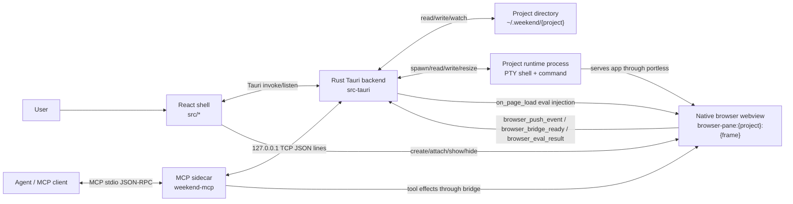

## Surface Inventory

| Surface | Owner | Direction | Main payloads |
| --- | --- | --- | --- |
| Tauri command IPC | React shell -> Rust | request/response | project CRUD, file I/O, terminal ops, browser ops, logs, themes |
| Tauri events | Rust -> React shell | broadcast/listen | `project-tree-changed`, `terminal-output`, `terminal-session-*`, `browser-webview-page-load`, theme/design events |
| Project filesystem | Rust -> disk | read/write/watch | `weekend.config.json`, `.mcp.json`, `.codex/config.toml`, `.weekend/*`, source files |
| PTY/process | React shell -> Rust -> shell | bidirectional stream | xterm input/output, project commands, agent commands |
| Portless runtime | React shell + Rust env -> process | command wrapper | `portless --name <project> --app-port <port> -- <dev command>` |
| Native browser webview | React shell + Rust | UI plus eval/navigation | runtime URL, injected bridge script, page load, screenshot, element grab |
| Browser event bridge | Browser webview -> Rust -> MCP/shell | command callbacks/events | console/errors/navigation/click/input/network/custom events |
| TCP bridge | MCP sidecar -> Rust | JSON line protocol | `hello`, `list_webviews`, `eval_js`, `navigate`, `get_url`, `drain_events`, `configure_observers` |
| MCP stdio server | Agent -> sidecar | MCP JSON-RPC | Weekend tools exposed to agents |
| Theme/design system | Shell/Rust -> project webviews/files | config plus injected JS/files | shell theme, design variable overrides, `shared-assets/weekend-design` |
| Shared assets/env | Shell/Rust -> all projects | files/env injection | `~/.weekend/shared-assets`, project `shared-assets`, shared env into PTYs |
| Logs/debug/preview | Shell/Rust -> disk/UI | read/write | backend logs, frontend logs, project logs, preview PNG |

## Command And Event Boundary

React sees Rust as a command server plus an event bus. Rust sees React as the
trusted local app window that can call the commands allowed in Tauri
capabilities.

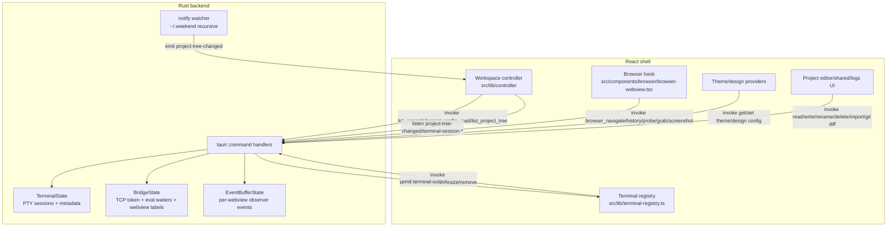

Core command groups:

- Projects: create from scratch or preset, list, archive, unarchive, delete,
  rename.
- Project config: read/write normalized `weekend.config.json`.
- Files: tree, read text/binary, write, rename, delete, import external files.
- Git: changed files and diffs.
- Terminal: open/write/resize/list/active process/session metadata/remove.
- Browser: navigate/history/probe/close stale webviews/element grab/screenshot.
- Browser callbacks: ready, push event, eval result.
- Shared: shared env and shared assets.
- Theme/design: active theme, design system config, sync design bundle.
- Logs/debug: frontend log batch, backend/project logs, runtime debug dump,
  project preview capture/load.

## Project Filesystem View

Rust's project model is directory-based. A project is a safe directory under
`~/.weekend/<project>`, except reserved root entries such as shared assets,
logs, and bridge files.

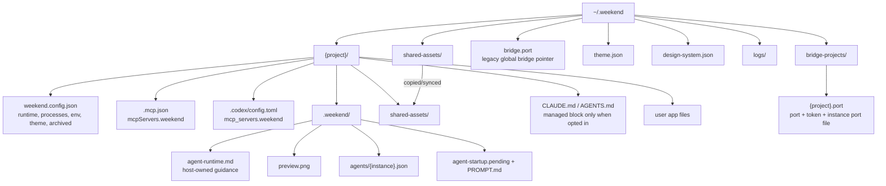

Important consequences:

- Project identity is the directory name. Renames rekey terminal IDs, rewrite
  default runtime URLs if still default, refresh MCP/Codex config, and remove
  the old project bridge file.
- `weekend.config.json` is the source of runtime truth for Play and browser
  routing.
- `.mcp.json` and `.codex/config.toml` point agents at the sidecar binary and
  set `WEEKEND_PROJECT=<project>`.
- Shared assets are physically copied into every project as
  `./shared-assets/`.
- The design system bundle is physically copied into
  `./shared-assets/weekend-design/` when enabled.

## Startup And Backfill

On app startup, Rust repairs and publishes host-managed surfaces before the
shell begins normal interaction.

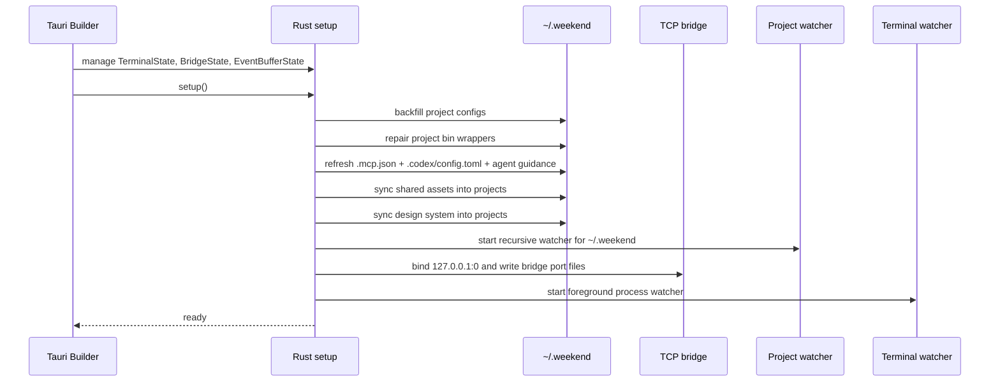

## Runtime And PTY Surface

Play is mostly TypeScript orchestration, but every actual process is owned by
Rust via `portable_pty`.

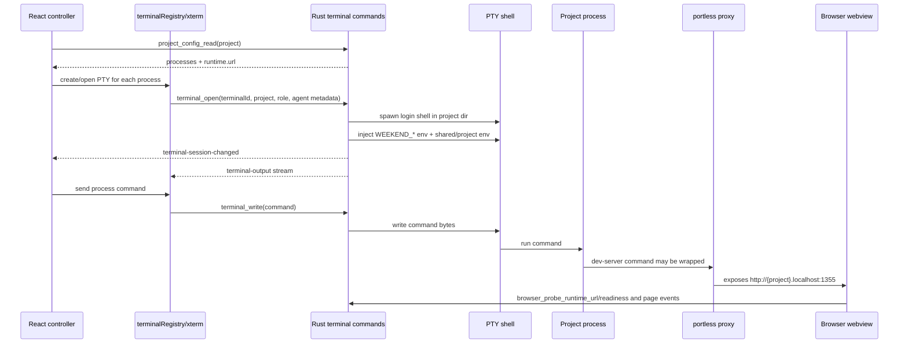

Key environment variables Rust injects into project terminals:

- `WEEKEND_PROJECT`
- `WEEKEND_TERMINAL_ID`
- `WEEKEND_RUNTIME_MODE`
- `WEEKEND_RUNTIME_URL`
- `WEEKEND_DEPLOY_URL`
- `WEEKEND_BRIDGE_TOKEN`
- `WEEKEND_BRIDGE_PORT_FILE`
- `WEEKEND_PORTLESS_BIN`
- `WEEKEND_PORTLESS_CLI`
- `WEEKEND_PORTLESS_BUNDLED`
- agent metadata variables for agent-role terminals
- shared env from `~/.weekend/shared.env.json`
- project env from `weekend.config.json`, overriding shared env

## Portless Surface

The shell treats `runtime.mode = "portless"` as the only supported runtime
mode. The browser URL defaults to `http://<sanitized-project>.localhost:1355`.

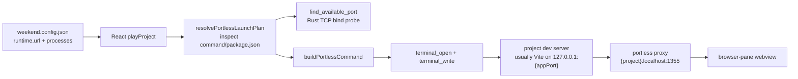

The wrapper is skipped when the configured command already looks portless
wrapped. For simple Vite package-manager dev commands, the launch plan adds
`--host 127.0.0.1 --port <appPort> --strictPort`.

## Browser Webview Surface

The React shell creates native child webviews, but Rust tracks and injects into
them through Tauri's `on_page_load`.

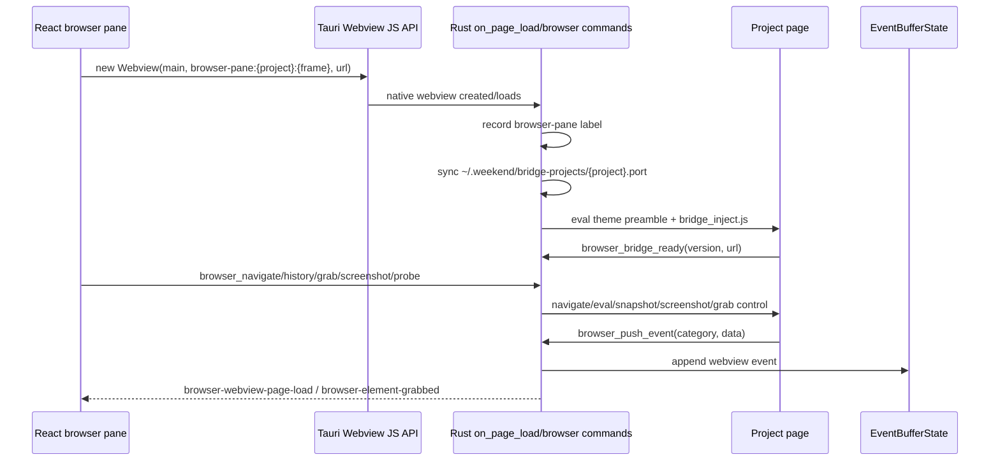

The injected browser bridge provides:

- readiness callbacks via `browser_bridge_ready`
- result callbacks for remote eval via `browser_eval_result`
- observer events via `browser_push_event`
- route change observation
- external link capture
- optional observers for console, errors, navigation, clicks, inputs, DOM
  mutations, network, element grab, and custom events

Remote browser pages are only granted the callback commands needed for the
bridge capability: eval result, push event, and bridge ready.

## TCP Bridge Surface

The main Rust app starts a local bridge on an OS-assigned loopback port.

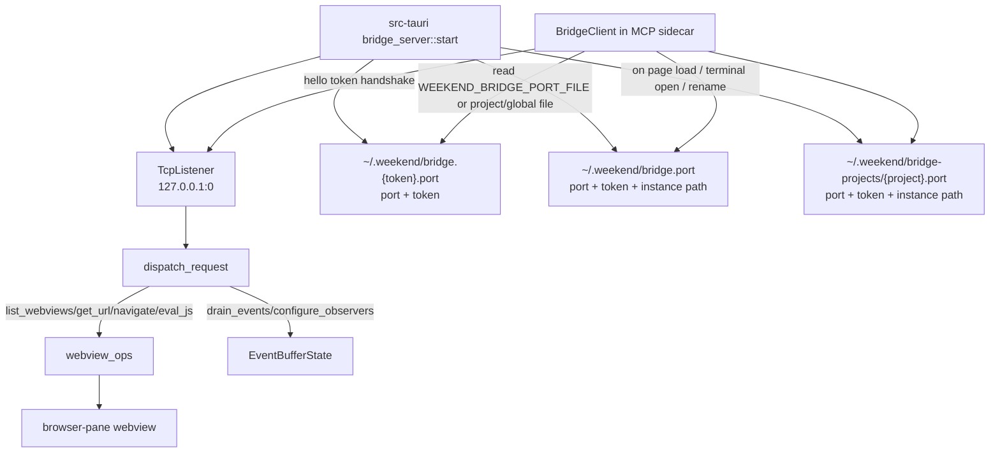

The TCP protocol is line-delimited JSON:

```json
{"id":"1","request":{"type":"list_webviews"}}
{"id":"1","status":"ok","data":["browser-pane:music:0"]}
```

Supported bridge request types:

- `hello`: token identity check
- `list_webviews`
- `eval_js`
- `navigate`
- `get_url`
- `drain_events`
- `configure_observers`

## MCP Surface

The MCP sidecar is a translator. Agents talk MCP stdio to `weekend-mcp`;
the sidecar talks TCP to the main Rust app; the main Rust app talks to native
webviews.

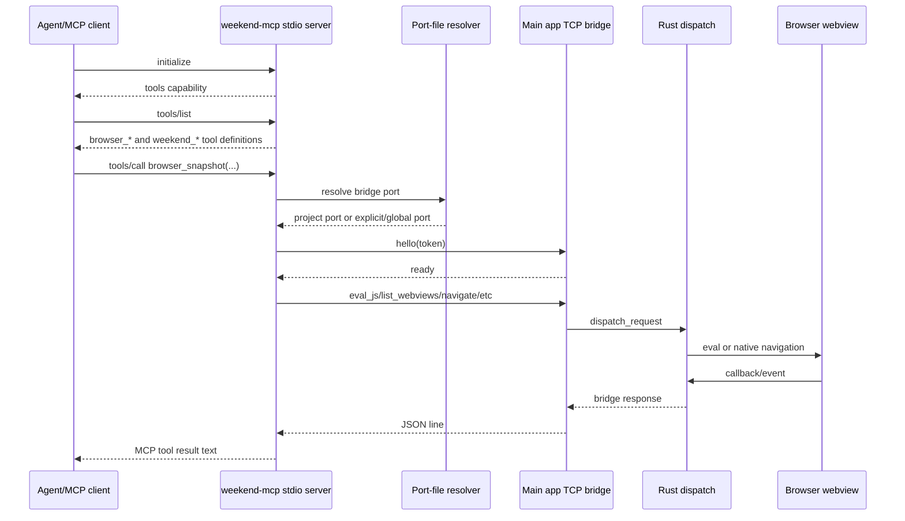

Default webview label resolution:

1. Use explicit `label` if the tool call provides one.
2. Else infer project from `WEEKEND_PROJECT`.
3. Else walk upward from current working directory until `.mcp.json`,
   `weekend.config.json`, or `aios.config.json` is found.
4. List webviews from the bridge.
5. Prefer a label matching `browser-pane:<project>:*`.
6. If there is exactly one webview, use it.
7. Otherwise return an error asking for an explicit label.

MCP tools exposed by the sidecar:

- `browser_eval_js`
- `browser_get_dom`
- `browser_get_text`
- `browser_click`
- `browser_type`
- `browser_snapshot`
- `browser_click_ref`
- `browser_type_ref`
- `browser_wait_for`
- `browser_scroll`
- `browser_navigate`
- `browser_get_url`
- `browser_list_webviews`
- `browser_observe`
- `browser_drain_events`

## Eval And Event Flow

Remote eval is intentionally callback-based. Rust cannot synchronously read JS
return values from `webview.eval`, so it installs a pending eval slot, injects a
wrapper, and waits for `browser_eval_result`.

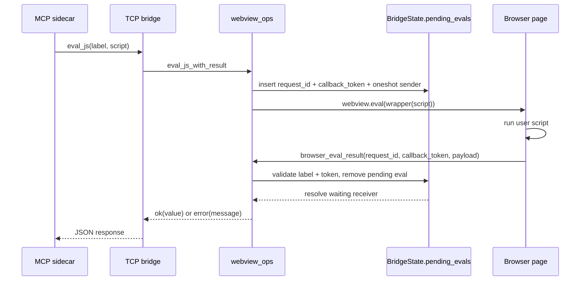

Observer flow is similar but event buffered:

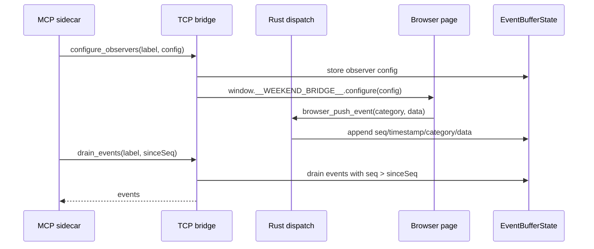

## Theme And Design Surface

The shell owns global theme and design variable defaults. Projects can opt out
of shell theme tracking in `weekend.config.json`.

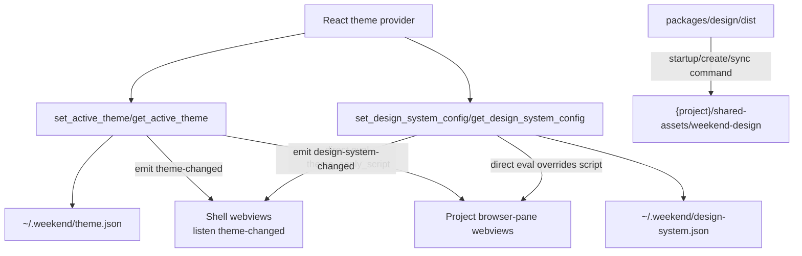

Injected project theme state anchors:

- `document.documentElement.dataset.theme`
- `.dark` / `.light` classes
- `window.__WEEKEND_SHELL_THEME__`
- `weekend:theme` browser event
- `window.__WEEKEND_SHELL_DESIGN_SYSTEM__`
- `weekend:design-system` and `weekend:design-system-overrides` events
- style tag `#weekend-project-ds-vars`

## Shared Assets And Env

Shared assets are host-level files copied into every project. Shared env is not
written into project files; it is injected into project terminal processes.

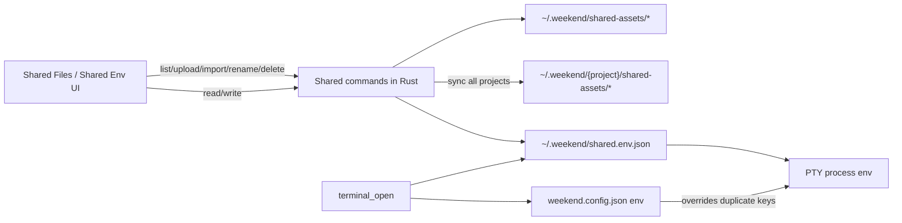

## State Ownership Summary

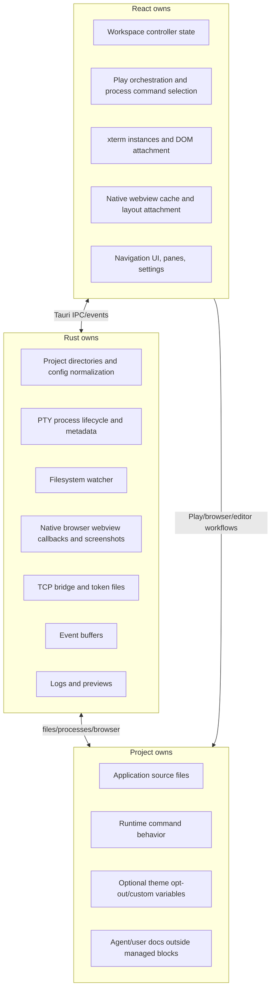

## Source Landmarks

- Main Rust command/event/backend surface: `src-tauri/src/main.rs`
- TCP bridge dispatcher: `src-tauri/src/bridge_server.rs`
- Bridge request/state types: `src-tauri/src/bridge_types.rs`
- Webview eval/navigation helpers: `src-tauri/src/webview_ops.rs`
- Browser event buffer: `src-tauri/src/event_buffer.rs`
- Browser injected script: `src-tauri/src/bridge_inject.js`
- MCP stdio server: `src-mcp/src/mcp_protocol.rs`
- MCP TCP client and port-file resolution: `src-mcp/src/bridge_client.rs`
- MCP tool definitions and tool-to-bridge translation: `src-mcp/src/tools.rs`
- React workspace controller: `src/lib/controller/index.ts`
- Project config/tree actions: `src/lib/controller/projects.ts`
- Portless launch planning: `src/lib/controller/portless.ts`
- Terminal xterm/PTY bridge: `src/lib/terminal-registry.ts`
- Native browser webview creation/layout: `src/lib/embedded-browser-webview.ts`
- Browser pane runtime behavior: `src/components/browser/browser-webview.tsx`
- Tauri command permissions/capabilities: `src-tauri/permissions/*`,
  `src-tauri/capabilities/*`
